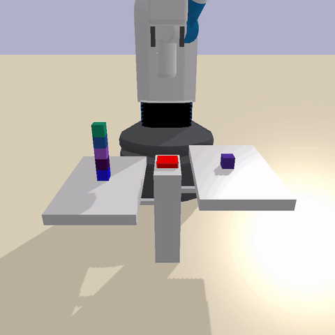
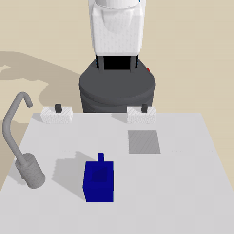
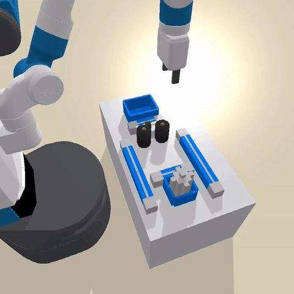
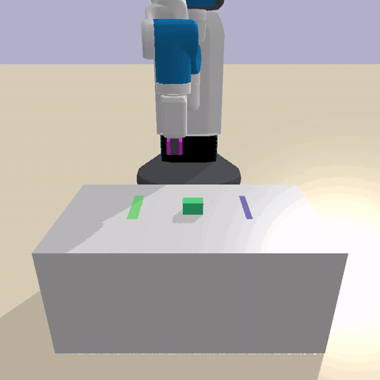
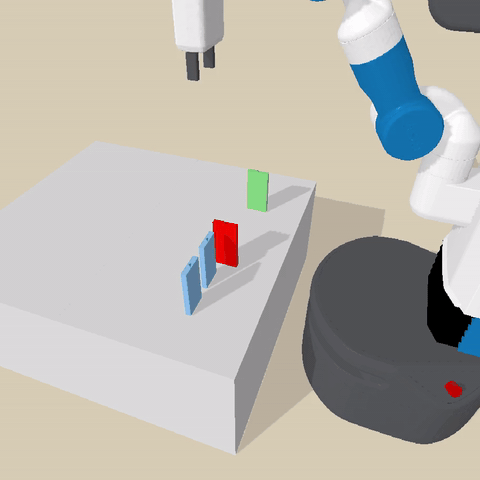
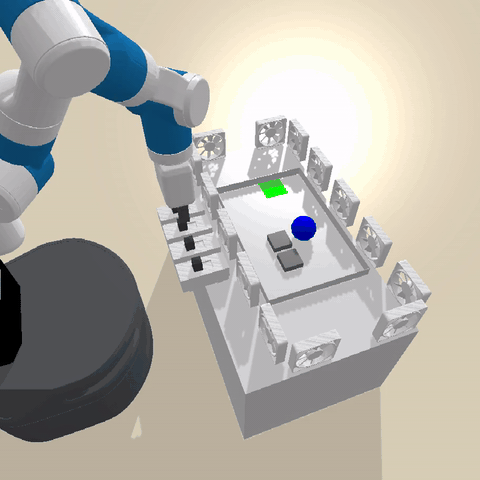
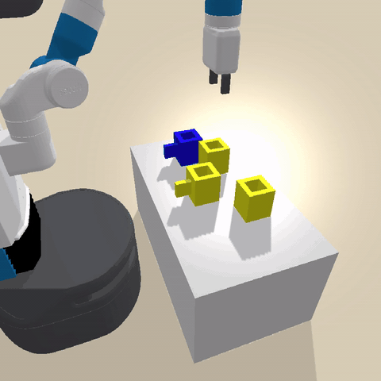
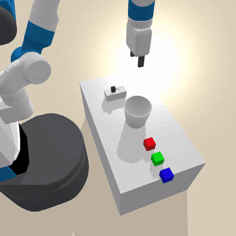
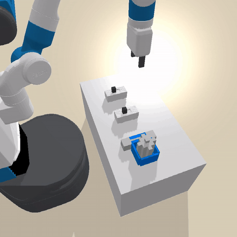

# MARA RoboSim


A collection of PyBullet robotic manipulation environments for world model learning and causal discovery research. Each environment features a Fetch or Panda robot interacting with objects on a tabletop.

## Installation

```bash
pip install -e ".[develop]"
```

## Quick Start

```python
import mara_robosim

mara_robosim.register_all_environments()
env = mara_robosim.make("mara/Blocks-v0")
obs, info = env.reset()
obs, reward, terminated, truncated, info = env.step(env.action_space.sample())
```

## Environments

| Environment | Preview | Description |
|---|---|---|
| `mara/Ants-v0` |  | Place food items near ants on a tabletop |
| `mara/Balance-v0` |  | Balance blocks on a beam by pressing buttons |
| `mara/Barrier-v0` |  | Move blocks past barriers to target locations |
| `mara/Blocks-v0` |  | Stack and arrange blocks on a table |
| `mara/Boil-v0` |  | Fill and boil water using a jug, faucet, and burner |
| `mara/Circuit-v0` |  | Assemble circuit components (batteries, wires, switch) |
| `mara/Coffee-v0` |  | Operate a coffee machine: plug in, brew, pour, serve |
| `mara/Cover-v0` |  | Place blocks to cover target regions |
| `mara/Domino-v0` |  | Set up domino chains with fans, balls, and ramps |
| `mara/Fan-v0` |  | Use fans to blow lightweight objects to goals |
| `mara/Float-v0` |  | Float light blocks by filling a container with water |
| `mara/Grow-v0` |  | Grow plants by watering them |
| `mara/Laser-v0` |  | Align lasers and mirrors to hit targets |
| `mara/MagicBin-v0` |  | Sort objects into magic bins that transform them |
| `mara/Switch-v0` |  | Toggle switches to open doors and move objects |

For a more thorough walkthrough (discovery, stepping, rendering, rollout GIF), see [`scripts/test_getting_started.py`](scripts/test_getting_started.py).

## Standalone API

Each environment can also be used directly without the Gymnasium wrapper:

```python
from mara_robosim.config import PyBulletConfig
from mara_robosim.envs.blocks import PyBulletBlocksEnv

config = PyBulletConfig(seed=0, num_train_tasks=5, num_test_tasks=5)
env = PyBulletBlocksEnv(config=config, use_gui=False)
tasks = env.get_train_tasks()
state = env.reset("train", 0)
```

## Project Structure

```
src/mara_robosim/
    __init__.py              # Gymnasium registration and make()
    structs.py               # Type, Object, State, Action, Predicate, etc.
    config.py                # PyBulletConfig (frozen dataclass)
    utils.py                 # Asset paths, geometry helpers
    gymnasium_wrapper.py     # Gymnasium.Env wrapper
    pybullet_helpers/        # Robot control, IK, controllers, geometry
    envs/                    # All 15 environment implementations
    assets/                  # URDFs, meshes, textures
tests/
    test_structs.py
    test_config.py
    test_gymnasium.py
    test_pybullet_helpers.py
    test_<env>_env.py         # one per environment (15 files)
```

## CI Checks

- **black** -- code formatting
- **isort** -- import ordering
- **pylint** -- linting
- **mypy** -- static type checking
- **pytest** -- unit tests

Run locally:

```bash
./run_ci_checks.sh
```
